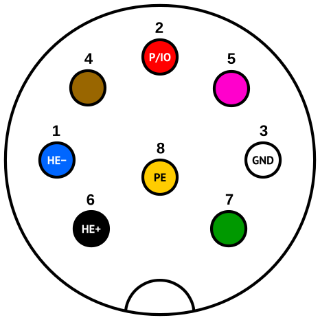
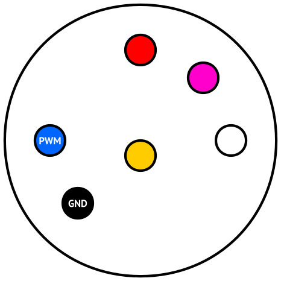
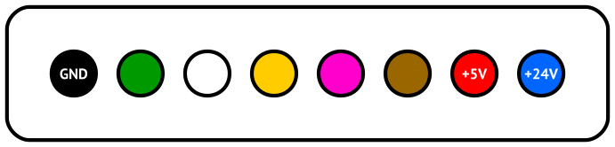
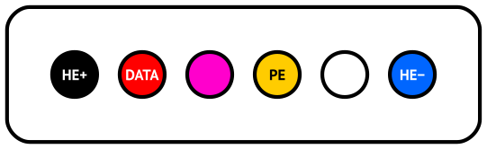
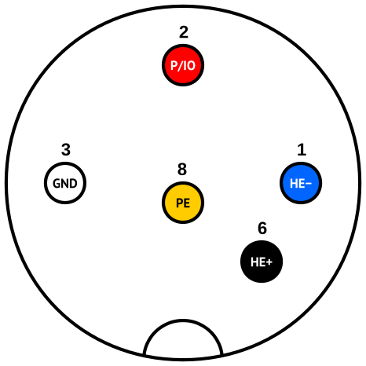
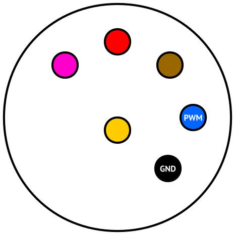

i-CON soldering station
=======================

Here we will examine interior of original [Ersa i-СON 2](http://www.kurtzersa.com/electronics-production-equipment/soldering-tools-accessories/soldering-desoldering-stations/produkt-details/i-con-2-9.html) soldering station.

Connectors
==========

External on the station
-----------------------

Left side (accepts i-Tool, Power-Tool, Tech-tool, Micro-Tool, Chip-Tool, X-Tool):

Right side (accepts i-Tool only):

Internal in station
-------------------

Connector on i-Tool
-------------------

Connector on ChipTool
-------------------

Communication
=============

To communicate with i-Tool, station uses `DATA` wire which combines both power and data. Furthermore data is half-duplex.

Station uses UART protocol:

- 230400 bps
- One start bit
- No parity bit
- One stop bit

Every 20 ms (50 Hz) station transmits following sequence:

    0x02 0x2F 0x05 0x10 0x00 0x05 0x8E 0x49

Transmit message format seems to be:

| Preamble | Command | Data           | Checksum |
|----------|---------|----------------|----------|
| 2 bytes  | 1 byte  | n bytes        | 2 bytes  |
| 0x2F02   | 0x05    | 0x10 0x00 0x05 | 0x498E   |

After approx 120 μs iTool starts to reply with status and temperature information. For example:

    0x02 0x2F 0x0A 0x10 0x00 0x05 0xC1 0x04 0x20 0x03 0x00 0x05 0xC1 0x04 0x20 0x03 0x00 0xAF 0xDE

Receive message format seems to be:

| Preamble | Status | Command Data   | Status data                                            | Checksum |
|----------|--------|----------------|--------------------------------------------------------|----------|
| 2 bytes  | 1 byte | n bytes        | m bytes                                                | 2 bytes  |
| 0x2F02   | 0x0A   | 0x10 0x00 0x05 | 0xC1 0x04 0x20 0x03 0x00 0x05 0xC1 0x04 0x20 0x03 0x00 | 0xDEAF   |
